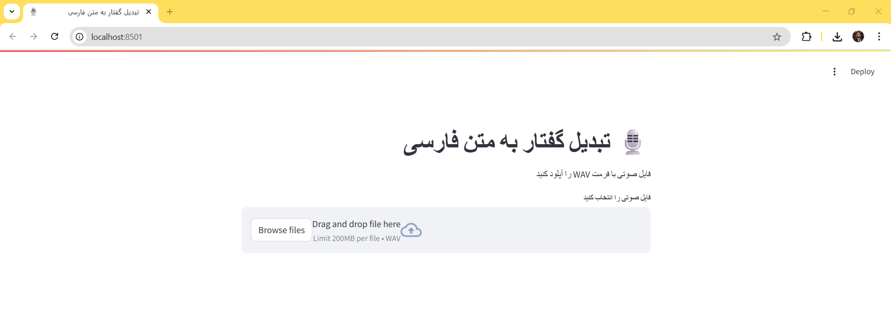

# 🎙️ Persian Speech-to-Text Converter


A web application that converts Persian (Farsi) speech in WAV audio files to text using Google's Speech Recognition API.

 <!-- Add your screenshot here -->

## ✨ Features
- Persian/Farsi speech recognition
- Simple web interface with Streamlit
- Audio playback before processing
- Text export functionality
- Right-to-Left (RTL) text display
- Real-time processing status

## 🛠️ Technical Stack
- **Frontend**: Streamlit
- **Speech Recognition**: `speech_recognition` library
- **Audio Processing**: Temporary WAV file handling
- **Language Support**: Persian (`fa-IR`)

## 🚀 Quick Start

### Prerequisites
- Python 3.8+
- Google Chrome/Firefox (for best RTL support)

### Installation
1. Clone the repository (if available)
2. Install requirements:
```bash
    pip install streamlit SpeechRecognition
```